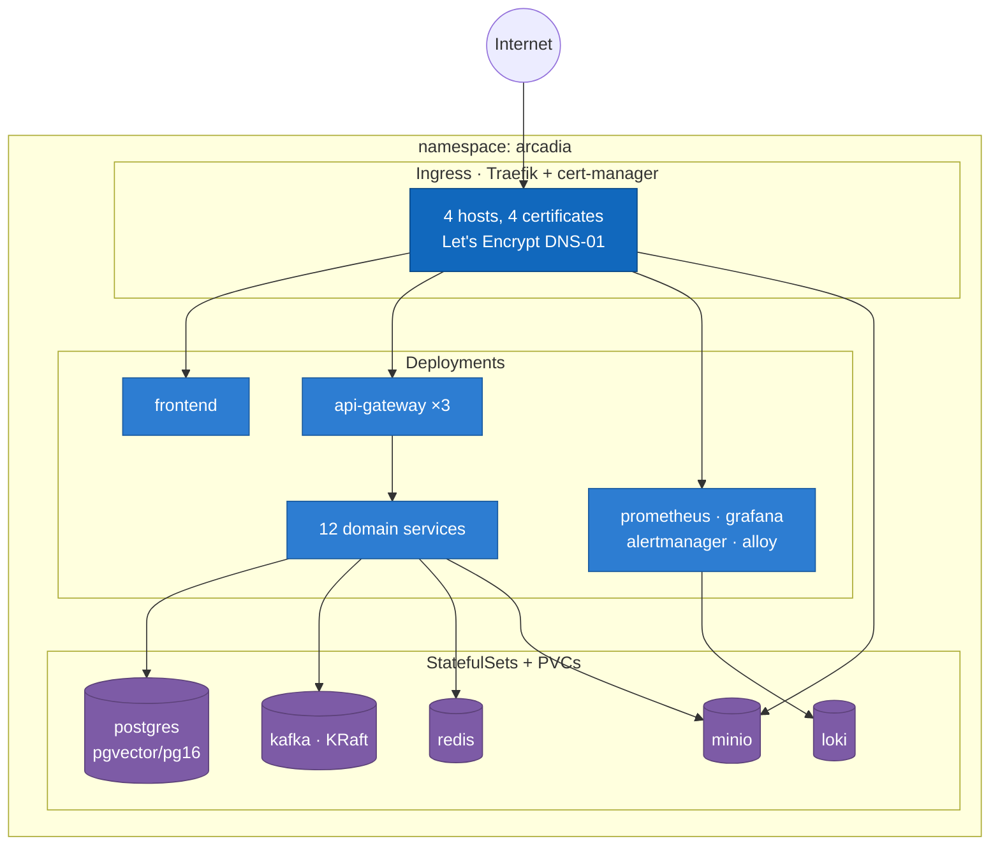
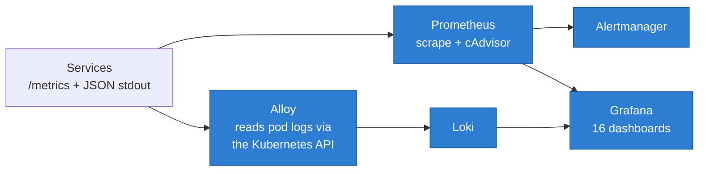

# Arcadia — Infrastructure

Deployment files for the [Arcadia](https://github.com/MS-Arcadia/PHASE02) platform. **This
repository contains no source code and compiles nothing.** It runs images that the service
repositories build.

Two deployment targets, from the same set of service images:

- **Kubernetes** — the live platform, in the `arcadia` namespace of a k3s cluster.
- **Docker Compose** — the whole platform on one machine, for development.

```
infra/
├── deploy/
│   ├── k8s/            the live platform: 27 manifests + apply.sh
│   │   └── observability/  Prometheus, Alertmanager, Loki, Alloy configs
│   ├── compose/        the local platform
│   ├── postgres/init/  one database and role per service
│   ├── observability/  Grafana dashboards and alert rules (shared by both targets)
│   └── seed-demo.py    demo content, driven through the public gateway
└── test/e2e/           123 checks against a running platform
```

## The live platform

| | |
|---|---|
| Storefront | `https://arcadia.aptcodegen.online` |
| API gateway | `https://api.arcadia.aptcodegen.online` |
| Grafana | `https://grafana.arcadia.aptcodegen.online` |
| Object storage | `https://minio.arcadia.aptcodegen.online` |

```bash
export KUBECONFIG=~/.kube/config.ahmz

./deploy/k8s/apply.sh --dry-run      # print what would change
./deploy/k8s/apply.sh                # namespace, secret, configmaps, manifests
./deploy/k8s/apply.sh --config-only  # refresh configmaps only
./deploy/k8s/apply.sh --restart      # roll every deployment
```

`apply.sh` is idempotent and refuses to run if `.env` still holds placeholder values.
Manifests are numbered so filename order is apply order: stateful backing services first
(`01`–`04`), domain services (`10`–`21`, `25`), edge (`22`–`24`), observability (`26`–`28`,
`33`–`34`), RBAC (`90`).

Each service repository deploys itself: its CI pushes an image to `ghcr.io` and runs
`kubectl set image` followed by `rollout status`. This repository owns the *shape* of the
deployment, not the act of deploying.

### Seeding a demo

```bash
export ARCADIA_API=https://api.arcadia.aptcodegen.online
eval $(kubectl -n arcadia get secret arcadia-secrets -o json | python3 -c "
import sys,json,base64
d=json.load(sys.stdin)['data']
for k in ('SUPER_ADMIN_EMAIL','SUPER_ADMIN_PASSWORD'):
    print(f'export {k}={base64.b64decode(d[k]).decode()}')")

python3 deploy/seed-demo.py
```

Idempotent, and it drives the **public gateway** with real accounts and real tokens rather
than writing rows — so a run that finishes is evidence the whole workflow works on the
deployment it just ran against.

## Getting started

Build the images first, in the service repositories, then start the platform:

```bash
make images      # calls each service's own `make docker`
make up
make wait        # blocks until every service reports ready
make e2e         # 123 checks against the running platform, ~20s
```

Or if the images already exist, just `make up`. `make help` lists the rest.

Docker is the whole deployment story here — there is no Kubernetes, no Helm and no
Terraform. Both service images carry a `HEALTHCHECK`, so `make ps` tells you whether the
platform is actually up rather than merely started.

| Service | | Language |
|---|---|---|
| Wallet | http://localhost:8080 · gRPC `:9090` | Go |
| Payment | http://localhost:8081 · gRPC `:9091` | Go |
| Catalog | http://localhost:8082 · [docs](http://localhost:8082/docs) | Python |
| Order | http://localhost:8083 · [docs](http://localhost:8083/docs) | Python |
| Media | http://localhost:8084 · [docs](http://localhost:8084/docs) | Python |
| Auth & Profile | http://localhost:8085 · [docs](http://localhost:8085/docs) | Python |
| Notification | http://localhost:8086 · [docs](http://localhost:8086/docs) | Python |
| Marketplace | http://localhost:8087 | Go |
| Review | http://localhost:8088 · [docs](http://localhost:8088/docs) | Python |
| Festival | http://localhost:8089 · [docs](http://localhost:8089/docs) | Python |
| Community | http://localhost:8091 · [docs](http://localhost:8091/docs) | Python |
| Search | http://localhost:8092 · [docs](http://localhost:8092/docs) | Python |
| Recommendation | http://localhost:8093 · [docs](http://localhost:8093/v1/docs) | Python |

```bash
curl -s localhost:8080/readyz
```

**MinIO** backs the media service's object store: S3 API on http://localhost:9000, console on
http://localhost:9001, logging in with `MINIO_ROOT_USER` / `MINIO_ROOT_PASSWORD` from `.env`.

The image is **pinned to `RELEASE.2025-04-22T22-12-26Z`, deliberately an old one.** MinIO stripped
the management features out of the community console in mid-2025 — later images serve a console
that browses objects and little else. This release still administers buckets, policies, users and
service accounts, which is the only reason to run a console beside a local stack at all.

The services never use the root credentials. `deploy/compose/minio-setup.sh` runs once at
`make up` and creates the bucket plus a separate user scoped to it, so a leaked service key can
read and write one bucket and nothing else — it cannot even create a bucket, which is why the
media service is configured with `S3_CREATE_BUCKET=false` and fails loudly on a typo in the
bucket name instead of quietly starting an empty store.

To exercise the API, import [`wallet-service/api/postman`](../wallet-service/api/postman) and
[`api/postman`](api/postman), then run **Setup → Mint tokens** in each.

## What runs, and what it costs

Eleven containers by default, roughly 3.0 GB with the limits set in the compose file:

| | Memory limit | |
|---|---|---|
| `postgres` | 384M | one database and role per service, eleven of them |
| `kafka` | 640M | KRaft mode, no ZooKeeper, one partition per topic |
| `redis` | 96M | gift-card rate-limit windows only, no persistence |
| `minio` | 512M | the object store; pinned to a release that still has an admin console |
| `auth-profile-service` | 256M | Python; Auth and Profile in one deployment, five Kafka consumers |
| `wallet-service` | 128M | Go |
| `payment-service` | 128M | Go |
| `catalog-service` | 160M | Python; one uvicorn worker |
| `order-service` | 160M | Python; one uvicorn worker |
| `media-service` | 224M | Python; uploads stream, so this does not scale with file size |
| `notification-service` | 208M | Python; five Kafka consumers, one per topic it reads |
| `marketplace-service` | 128M | Go; one database and one periodic matching job |
| `review-service` | 160M | Python; one uvicorn worker |
| `festival-service` | 160M | Python; one uvicorn worker |
| `community-service` | 160M | Python; one uvicorn worker |

The Python services get 160M rather than 128M because a CPython process with SQLAlchemy and
aiokafka loaded starts higher than a Go binary does. One uvicorn worker each: a second worker
inside the container would double the database pool and the Kafka consumers without doubling
anything the service is short of.

The media service is the one worth watching. Its limit does **not** scale with upload size —
uploads and downloads both stream in 1 MiB chunks, so a 4 GB game build passes through a
224 MB container. It gets 224M rather than 160M because the S3 adapter buffers one 8 MiB part per
concurrent upload before escalating to multipart, and botocore's service model is a few MB
resident.

**MinIO is the single biggest cost of the stack**, and it is optional. Set
`MEDIA_STORAGE_BACKEND=filesystem` in `.env` to drop it and get 512 MB back; the media service
falls back to the `media-data` volume and the platform works exactly as before. What you lose is
the ability to run more than one replica of it — two on different hosts do not see each other's
files — and a store that can outgrow one disk. Switching an existing store needs
`make media-migrate` to copy the objects across, or every download 404s.

Also worth knowing: with the filesystem backend the media volume shares a disk with Postgres, so
filling it stops the database from writing. That is what the per-developer quota is for.

Metrics are opt-in and add two more:

```bash
make up-metrics      # + Prometheus (256M) and Grafana (256M)
```

There is no OpenTelemetry collector, no Loki and no Tempo. Prometheus scrapes each
service's `/metrics` directly, and log correlation works through the correlation id the
services already stamp on every line — which answers "show me everything for this
purchase" without three more containers to run. The collector earns its place when
several backends need the same signals; with one backend and two services it is a
container that only forwards.

---

## Cluster topology



**PostgreSQL runs `pgvector/pgvector:pg16`, not the stock image.** recommendation-service
stores embeddings in a `vector` column and its migration opens with `CREATE EXTENSION IF NOT
EXISTS vector`. On the stock image that migration fails, the service logs it and carries on
starting — so it reports healthy while every query against the new columns errors.

Autoscaling: the gateway floors at 3 replicas and scales to 10; every domain service floors
at 1 and scales to 4, all on 70% CPU. auth-profile-service gets a full CPU core rather than
the usual 150m, because bcrypt at a fifth of a core takes longer than its liveness probe's
timeout and the kubelet kills a pod doing exactly what it was asked to do.

## Observability



Dashboards are **generated**, not hand-drawn — `deploy/observability/generate-dashboards.py`
emits one per service plus an overview, and `--check` runs in CI so a dashboard cannot drift
from the metrics it queries.

Alloy reads logs through the Kubernetes API rather than tailing `/var/log/pods` from a
hostPath: no privileged container and no host mount on a shared cluster, and RBAC scoped to
reading pods in one namespace. The trade is load on the API server, negligible at this size.

Tracing one request across services, in Grafana → Explore → Loki:

```logql
{namespace="arcadia"} |= "<correlation-id>"
```

## Why one PostgreSQL instance

The architecture document specifies Database-per-Service. This runs **one PostgreSQL
container with one database and one role per service**, which is the same pattern at a
different scale.

What Database-per-Service actually requires is that no service can read or write another
service's data. That is enforced in
[`deploy/postgres/init/01-databases.sql`](deploy/postgres/init/01-databases.sql) by
grants, not by convention: `CONNECT` is revoked from `PUBLIC`, so `wallet_user`
physically cannot reach `payment_intents` — exactly as it could not if the two lived on
different hosts.

**What is given up** is independent failure and scaling of the storage layer. **How that
is repaid**: a service knows nothing about storage beyond its own `DATABASE_URL`, so
promoting one database to its own instance — a second Postgres container here, a managed
instance later — is a change to one connection string. No application query joins across
databases, so nothing prevents it.

## Event topics

| Topic | Producer | Consumed by |
|---|---|---|
| `wallet-events` | wallet | **order (saga replies)**, Auth (abuse flags) |
| `audit-events` | wallet | the audit sink |
| `payment-events` | payment | wallet |
| `wallet-commands` | **order** | wallet |
| `game-events` | **catalog** | **order (ownership replies)**, **notification**, **review**, **community**, **recommendation**, Search, Profile |
| `catalog-commands` | **order** | **catalog** |
| `purchase-events` | **order** | **notification**, **recommendation**, Profile |
| `media-events` | **media** | **community**, Search, Profile |
| `trade-events` | **marketplace** | wallet, **notification** |
| `festival-events` | **festival** | **notification** |
| `review-events` | **review** | **recommendation**, Search, Profile |
| `community-events` | **community** | Profile (top posts), Search |
| `user-events` | **Auth** | wallet, **notification**, **review**, **community**, Profile |
| `reco-events` | **recommendation** | Profile |

The notification service reads five of these (`game-events`, `purchase-events`, `user-events`,
`trade-events`, `festival-events`) and is the only consumer of one — `festival-events`. It does not
read `review-events` or `community-events`: a report on a review or a post is Support's business, and
Support already sees it in the queue inside the service that owns it, not as a notification. It
deliberately does **not** read `wallet-events` either, which is where an earlier version of this table
put it: that topic carries every balance change on the platform, and "your balance changed" is not
news to somebody who just spent money. The things worth telling a person about money are the order
events, which say what the money was for.

The two **`-commands`** topics are different from the rest. They are addressed to exactly one
service, so an unrecognised message on them is dead-lettered rather than ignored: it means the
sender is issuing a command the receiver does not implement, which is a contract violation
worth an operator's attention.

Everything ending in `-events` is shared. A consumer there ignores what it does not handle —
`wallet-events` carries every balance change on the platform, and the order service has no
business dead-lettering a gift-card redemption.

Every consumed topic has a `<topic>.dlq` companion. Broker-side auto-creation is **off**:
each service declares the topics it owns at boot, so a typo fails loudly rather than
silently creating a topic nobody reads.

## What is deliberately not here

**No Helm, no Terraform.** The manifests are plain YAML applied by a shell script. Helm
would buy templating across environments, and there is one environment; Terraform would buy
cluster provisioning, and the cluster is provisioned. Both would be machinery maintained for
a second environment that does not exist.

The Compose stack remains the development target, and the notes below describe how it covers
what the cluster gives the live deployment:

* **Health.** Both images declare a `HEALTHCHECK` that calls the binary's own
  `healthcheck` subcommand — the images are distroless, so there is no `curl` or shell
  for the usual form to invoke. It probes `/readyz`, not `/livez`: `/livez` deliberately
  checks nothing, and conflating the two is how a database blip becomes a restart loop
  that makes an outage worse.
* **Restarts.** `restart: unless-stopped` on every container.
* **Memory limits, but no CPU limits.** Throttling a service that holds database row
  locks turns a latency spike into lock contention across the platform; a memory leak
  should be killed rather than starve its neighbours.
* **Network isolation.** Compose puts everything on one bridge network and only the
  ports in `.env` reach the host. The finer-grained thing worth wanting is an egress
  restriction on the payment adapter, the platform's only route to the public internet —
  that needs a real network policy, and it is the first thing to add if this ever moves
  to a cluster.

## End-to-end tests

`make e2e` runs 123 checks against the running platform: a game published, bought, refunded and
gifted, the compensation path reached with a real race, files uploaded and served, and then the
invariants no API exposes — every dead-letter topic empty, every outbox drained, every balance
still equal to the sum of its ledger.

It is **not** in CI, and that is a deliberate choice rather than an omission — the reasoning,
and the job to add if you want it, are in [`test/e2e/README.md`](test/e2e/README.md).

It exists because the five services had 389 unit tests, all green, and nine bugs surfaced in
the first hour the platform was actually run with Docker. None was about logic; every one was
about configuration or topology. `make e2e-health` alone is the quickest useful check after an
incident.

```bash
make e2e          # everything, ~20s
make e2e-health   # just the invariants, ~5s, changes nothing
```

Repeatable: every run uses fresh user ids, so it does not need `make nuke` first.

## Alerts

[`deploy/observability/alerts.yml`](deploy/observability/alerts.yml) is the SLO table from
the architecture document as executable rules. The severity split is the point: `page`
wakes somebody up, `ticket` waits for business hours. Only things that mean money was
lost, or that the ledger no longer adds up, page — an alert set where everything is urgent
trains people to ignore all of it.

`LedgerMismatch` has a runbook: [`docs/runbooks/ledger-mismatch.md`](docs/runbooks/ledger-mismatch.md).

## Adding a service

1. Add its database and role to `deploy/postgres/init/01-databases.sql`, then `make nuke`
   — the init script only runs on an empty data directory.
2. Add it to `deploy/compose/docker-compose.yml` with an `image:` line. It builds its own
   image; this repository does not.
3. Add a scrape target to `deploy/observability/prometheus.yml`.
4. Add its `make docker` to the `images` target and bump `SERVICE_COUNT` in the Makefile, so
   `make wait` knows how many containers to expect.
